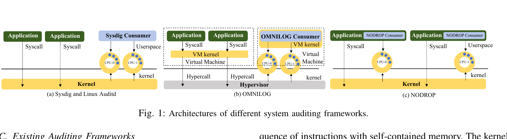
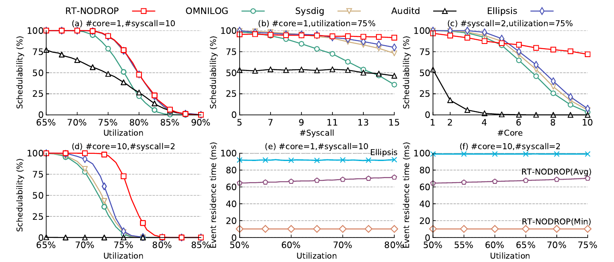
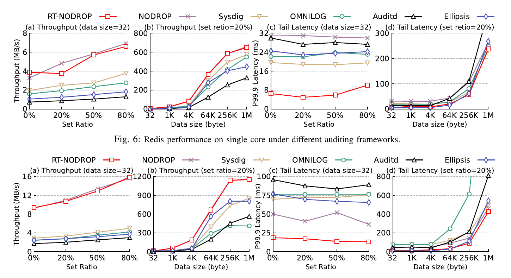
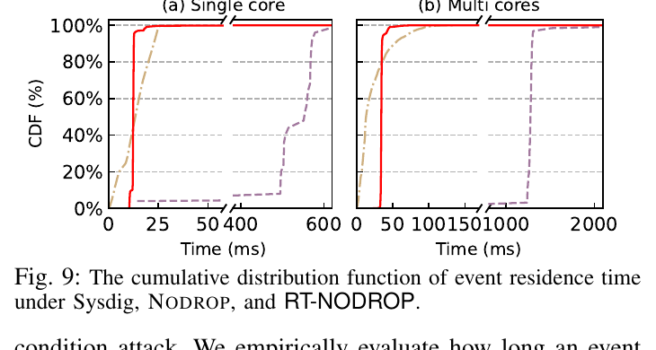

# RT-NODROP

## Predictable and Secure System Auditing for Real-Time Systems

[](https://ieeexplore.ieee.org/document/11315100/)
[](https://github.com/fanhang-hu/RT-NODROP)

**Peng Jiang, Fanhang Hu, Ruizhe Huang, Shuomin Xue, Zhaomeng Deng, Yuxin Ren, Ning Jia, Yao Guo, Xiangqun Chen, Ding Li, Guang Cheng**

Southeast University · Peking University · Huawei Technologies

Research code for **RT-NODROP**, a real-time system auditing framework designed to balance security, predictability, and efficiency. The paper presents a lightweight threadlet-based architecture, periodic audit-event processing, overhead-aware response-time analysis, and consumer-period selection for real-time workloads.

> **Repository status.** This checkout currently contains the analytical and schedulability-evaluation subset of RT-NODROP. It does not yet include the complete kernel-level threadlet implementation or the full Redis benchmark harness from the paper. The README documents the complete research context while keeping the current release scope explicit.

<p align="center">
  
</p>

<p align="center"><em>Architectural context from the RT-NODROP paper: asynchronous single-consumer auditing, synchronous OMNILOG, and per-thread NODROP-style consumers.</em></p>

## Overview

System auditing is important for intrusion detection, provenance analysis, compliance verification, and attack reconstruction. In a real-time system, however, audit processing is also part of the execution workload: syscall tracing increases task WCET, while audit consumers compete with application tasks for CPU time.

Existing designs typically optimize one goal at a time. A shared consumer can introduce priority inversion and cross-core interference; synchronous event transmission can impose high syscall and virtualization overhead; and large buffers or batch processing can lead to long event residence times and bursty WCET.

RT-NODROP addresses these issues by associating audit processing with the task that generates the events and invoking the corresponding consumer periodically. The paper-level design aims to provide:

- bounded audit-processing WCET;
- bounded event residence time in the kernel buffer;
- no event dropping under the bounded-workload model;
- explicit integration of audit overhead into real-time response-time analysis; and
- task-aware control of the consumer invocation period.

In the current repository, these ideas are represented as schedulability-analysis models. The Python code generates periodic task sets, adds syscall-related overhead, models consumer interference, and compares RT-NODROP-style analysis with several single-consumer baselines.

## Key Contributions

- **Real-time auditing model:** Represents audit event processing as explicit consumer tasks that participate in fixed-priority analysis.
- **Overhead-aware RTA:** Accounts for per-syscall tracing cost and consumer processing interference when checking task deadlines.
- **Residence-time analysis:** Estimates the time an audit event waits in the kernel buffer and is processed by its consumer.
- **Baseline comparison:** Provides analytical comparison paths for RTA, OMNILOG, Auditd-style auditing, Ellipsis, and NODROP-style processing.
- **Reproducible experiment driver:** Sweeps utilization, syscall count, and CPU count with fixed seeds and structured output files.

## What Is Included in This Checkout

| Research component | Current implementation |
| --- | --- |
| Periodic real-time task generation | `rta/util_syscall_cpu.py`, using the SchedCAT EMSTADA generator |
| Baseline response-time analysis | `rta/rta.py` |
| OMNILOG-style single-consumer analysis | `rta/rta_omnilog.py` |
| Ellipsis/Auditd-style comparison analysis | `rta/rta_ellipsis.py` and `rta/util_syscall_cpu.py` |
| NODROP-style consumer analysis | `rta/rta_nodrop.py` |
| Audit overhead parameters | `rta/params.py` |
| Experiment orchestration and output | `rta/safety_aware_sched.py` |
| Design and validation notes | `docs/feature_design.md`, `docs/test_plan.md` |

The following paper components are planned for a later refactor or are outside this release:

- the kernel module and full threadlet-based runtime;
- the complete OpenEuler/Linux deployment and Redis benchmark harness;
- the original paper's particle-swarm consumer-period optimizer; and
- the full paper source tree and raw benchmark data.

The current experiment configuration uses a fixed consumer-period factor of `1.0`, so the generated consumer period is equal to its associated task period.

## Main Results Reported in the Paper

The following numbers are reported by the RT-NODROP paper. They describe the complete paper evaluation and should not be interpreted as results automatically regenerated by the current Python-only subset.

| Evaluation | Reported result |
| --- | --- |
| Schedulability improvement | Up to **80.11%** over Sysdig, **117.9%** over OMNILOG, and **51.05%** over Ellipsis |
| Schedulable utilization area | **11.63%**, **21.98%**, and **8.64%** improvement over Sysdig, OMNILOG, and Ellipsis, respectively |
| Redis throughput | Up to **75.1%** higher than Sysdig, **138.86%** higher than OMNILOG, and **324.6%** higher than Ellipsis |
| Redis P99.9 tail latency | **2.19x**, **3.07x**, and **5.02x** lower than Sysdig, OMNILOG, and Ellipsis, respectively |
| Event residence time | Minimum residence time around **10 ms** without event dropping in the reported evaluation |

### Schedulability and Residence-Time Analysis

<p align="center">
  
</p>

<p align="center"><em>Paper Fig. 4: schedulability and event residence-time trends under utilization, syscall-count, and CPU-count sweeps.</em></p>

### Redis Performance

<p align="center">
  
</p>

<p align="center"><em>Paper Figs. 6-7: single-core and multi-core Redis throughput and P99.9 tail latency.</em></p>

### Event Residence-Time Distribution

<p align="center">
  
</p>

<p align="center"><em>Paper Fig. 9: cumulative distribution of event residence time for Sysdig, NODROP, and RT-NODROP.</em></p>

## Quick Start

### Dependencies

The current analysis path follows the legacy SchedCAT environment:

- Python 2.7;
- NumPy and SciPy;
- SchedCAT, available at `lib/schedcat` in the intended experiment layout;
- GNU Make, SWIG 3.0, a GNU C++ compiler, and GMP; and
- CPLEX only when using SchedCAT components that require an LP solver.

The repository currently keeps the SchedCAT dependency separate. If it is provided as a submodule in your checkout, initialize and build it with:

```bash
git submodule update --init --recursive
source setpath.sh
cd lib/schedcat && make && cd ../..
```

### Run a representative experiment

Run a utilization sweep with 1,000 random task-set samples per point:

```bash
python rta/safety_aware_sched.py \
    --experiment utilization \
    --samples 1000
```

Run all three experiment families:

```bash
python rta/safety_aware_sched.py \
    --experiment all \
    --samples 1000
```

For a small smoke test:

```bash
python rta/safety_aware_sched.py \
    --experiment utilization \
    --samples 2 \
    --util-min 0.50 \
    --util-max 0.51 \
    --util-step 0.01 \
    --output-dir output/smoke
```

The command-line interface can be inspected without loading SchedCAT:

```bash
python rta/safety_aware_sched.py --help
```

## Experiment Matrix

| Experiment | Swept variable | Default range | Fixed settings | Output |
| --- | --- | --- | --- | --- |
| `utilization` | CPU utilization | `0.50` to `1.00`, step `0.01` | 1 CPU, 10 tasks, 10 syscalls/task | `output/safety_aware_sched/utilization.txt` |
| `syscall_count` | Syscall count | `5` to `15`, step `1` | Utilization `0.75` | `output/safety_aware_sched/syscall_count.txt` |
| `cpu_count` | Number of CPUs | `1` to `10`, step `1` | Utilization `0.75`, 10 syscalls/task | `output/safety_aware_sched/cpu_count.txt` |

Every run records the configuration, execution environment, tabular data, timestamps, and duration. The default random seed is `20260707`; use `--seed` to select another seed.

## Output Metrics

The generated data table includes:

- `#rta`: baseline response-time analysis without audit consumers;
- `#rta_omnilog_delta=*`: OMNILOG-style comparison paths with different syscall overhead parameters;
- `#rta_audit`: Auditd-style comparison path;
- `#rta_ellipsis`: Ellipsis-style comparison path;
- `#rta_nodrop`: NODROP-style per-task consumer analysis;
- `RES_MAX_ND`: maximum RT-NODROP event residence time collected from schedulable samples;
- `RES_MIN_ND`: minimum RT-NODROP event residence time collected from schedulable samples; and
- `RES_MEAN_ND`: mean RT-NODROP event residence time collected from schedulable samples.

Residence-time statistics are collected only for samples that pass the `#rta_nodrop` schedulability analysis. This makes the residence-time columns conditional metrics rather than unconditional statistics over all generated task sets.

## Repository Structure

```text
RT-NODROP/
├── rta/
│   ├── params.py                 # Audit-framework parameters
│   ├── rta.py                   # Baseline response-time analysis
│   ├── rta_omnilog.py           # OMNILOG-style analysis
│   ├── rta_ellipsis.py          # Ellipsis/Auditd-style analysis
│   ├── rta_nodrop.py            # NODROP-style consumer analysis
│   ├── util_syscall_cpu.py      # Task generation and test setup
│   └── safety_aware_sched.py    # Main experiment entry point
├── toolbox/                     # Local statistics and utility helpers
├── docs/
│   ├── feature_design.md        # Design and analysis notes
│   └── test_plan.md             # Reproduction and validation plan
├── figs/                        # Figures used by this README
├── results/                     # Example result artifact
├── setpath.sh                   # SchedCAT and solver environment variables
└── README.md
```

## Reproduction Notes and Limitations

The current release is an analytical experiment framework, not a drop-in real-time auditing runtime. In particular:

- task sets are generated with SchedCAT and analyzed using fixed-priority response-time bounds;
- the default model assumes bounded syscall counts, bounded audit overhead, implicit deadlines, and partitioned execution;
- the multi-CPU path analyzes each generated partition independently;
- the paper's physical deployment, kernel integration, and Redis measurements require additional code and experimental infrastructure; and
- exact paper figures require the paper's original platform, parameter calibration, and benchmark workload.

For a clean publication release, the next refactor should separate the reusable analysis library, experiment configuration, plotting scripts, raw data, and any kernel/runtime implementation into clearly named modules.

## Citation

If you use this code or the RT-NODROP analysis, please cite:

```bibtex
@inproceedings{jiang2025rtnodrop,
  title     = {Predictable and Secure System Auditing for Real-Time Systems},
  author    = {Jiang, Peng and Hu, Fanhang and Huang, Ruizhe and Xue, Shuomin and
               Deng, Zhaomeng and Ren, Yuxin and Jia, Ning and Guo, Yao and
               Chen, Xiangqun and Li, Ding and Cheng, Guang},
  booktitle = {2025 IEEE Real-Time Systems Symposium (RTSS)},
  pages     = {244--257},
  year      = {2025},
  doi       = {10.1109/RTSS66672.2025.00028}
}
```

## License

An MIT license file is included in the repository. Replace its placeholder copyright fields before the final public release.

## Acknowledgements

The schedulability experiments build on the [SchedCAT](https://github.com/gwsystems/schedcat) toolkit. Please see the [RT-NODROP paper](https://ieeexplore.ieee.org/document/11315100/) for the complete system design, proofs, implementation details, and evaluation methodology.
